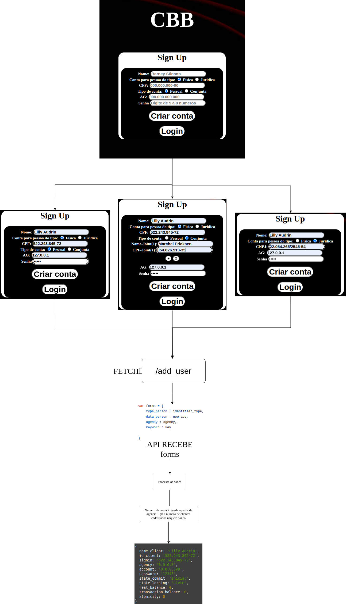
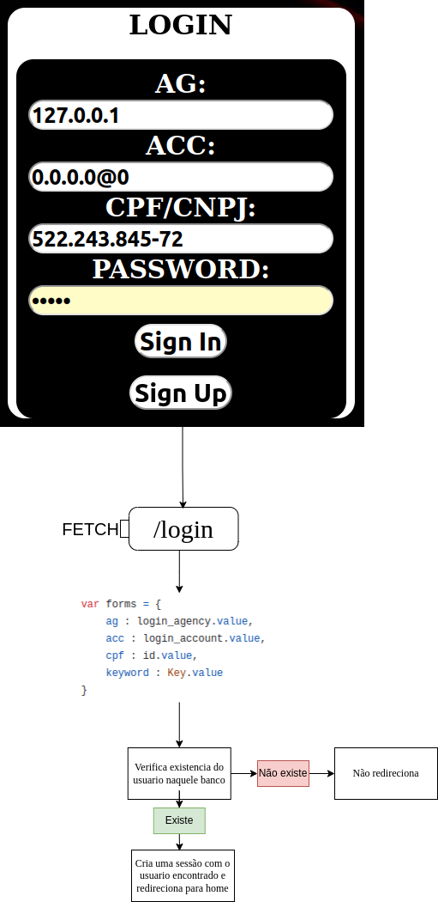
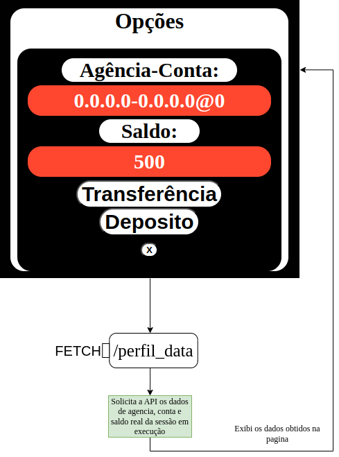
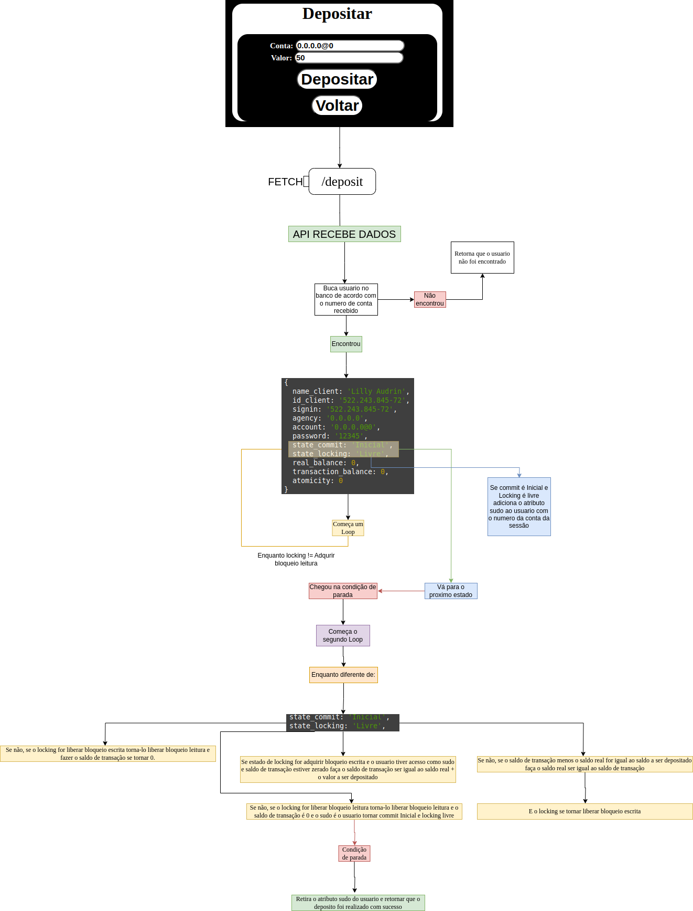

# Transações Bancárias Distribuidas

## Introdução

Sistema distribuído para transações financeiras entre bancos pertencentes a um consórcio, semelhante ao sistema Pix, mas sem um banco central para coordenar as transações.
Para isso:
1. As contas bancárias são criadas de forma distribuída, o que significa que cada banco participante do sistema tem seu próprio conjunto de contas para seus clientes.
2. Transações atômicas garantem que uma série de operações seja executada como uma unidade indivisível. Isso significa que, se uma transação envolve mover dinheiro entre várias contas de diferentes bancos, ou mesmo dentro do mesmo banco, ela deve ser executada integralmente ou não ser executada.
3. Os bancos se comunicam para verificar e autorizar transações entre suas contas. Essa comunicação foi feita de modo que apenas transações válidas sejam processadas e que todas as partes envolvidas concordem com o estado final das transações.
4. O sistema garante que as contas não movimentem mais dinhero do que tem disponivel. Ele tambem evita duplo gasto garantindo a impossibilidade de um mesmo dinheiro ser usado mais de uma vez.

## Gerenciamento de contas

### Criação de conta
Para cada banco no consórcio, a criação de contas é gerenciada associando o IP do banco ao número da agência. Isso significa que cada banco é identificado por um IP específico que está ligado diretamente aos números das agências disponíveis.

#### Formato dos Números de Conta

Cada conta de cliente associada a uma agência é identificada pelo seguinte formato:

IP_do_Banco@número_de_contas_cadastradas_no_banco

#### Onde:

1. `IP_do_Banco` é o endereço IP único atribuído ao banco.
2. `número_de_contas_cadastradas_no_banco` é um número que representa a quantidade de contas já cadastradas nesse banco.

#### As informações necessarias para criação da conta são:

1. Nome
2. CPF/CNPj
3. Número da agência-IP
4. Senha

Uma conta só será criada se todos estes campos forem preenchidos e o CPF/CNPj de uma conta pessoal/juridica não pode ser igual ao de outra conta do mesmo tipo ja cadastrada naquele banco. Mas é possivel criar varias contas conjuntas formadas por CPFs que ja estão cadastradas naquele banco.

#### O fluxograma a seguir mostra o funcionamento do cadastro de novos clientes:

##### Para contas pessoais:
1. A opção `Fisica` no radio box vem selecionada por padrão.
2. Ela faz o campo de CPF ser exibido. 
3. A opção `Pessoal`no radio box vem selecionada por padrão.
4. Ela mostra apenas um campo de CPF e nome

##### Para contas Conjuntas: 
1. A opção `Fisica` no radio box vem selecionada por padrão.
2. Ela faz o campo de CPF ser exibido.
3. Marque a opção conjunta no radio box.
4. Aparecera dois botões `+` e `x`.
5. Ao clicar no `+`um novo campo para CPF e nome sera exibido.
6. É possivel adicionar quantas pessoas quiser a conta conjunta.
7. Ao clicar no `x` um dos campos sera excluido.
8. O campo padrão não é afetado por essa opção

##### Para contas jurÍdicas:
1. Selecione a opção "Jurídica".
2. Isso fara com que o campo de CNPj seja exibido e o de CPF desabilitado.
3. Tambem fara com que os campos `Pessoal` e `Conjunta` sejam desabilitados.

### Sistema de login/sessão

Embora seja possível criar uma conta em qualquer banco do consórcio a partir de qualquer outro, é fundamental acessar cada banco utilizando a URL correta associada a ele. Isso garante o acesso seguro e direto aos serviços bancários específicos de cada instituição. Assim o login so é permitido se o numero da agencia corresponder ao IP da URL.

#### As informações necessarias para login são:

1. CPF/CNPj
2. Numero da conta
3. Número da agência-IP
4. Senha

Após fornecer as informações necessárias e clicar no botão de login, a API do banco correspondente irá buscar um usuário que corresponda às suas credenciais dentro daquele banco específico. Se um usuário compatível for encontrado, a autenticação será realizada com sucesso.

#### Criação de Sessão

Após a autenticação bem-sucedida, uma sessão será criada para o usuário. Esta sessão permite o acesso às seguintes rotas:

1. Tela Inicial: Oferece uma visão geral das informações da conta e das opções disponíveis.
2. Transações: Permite ao usuário realizar operações financeiras, como transferências e pagamentos.
3. Depósitos: Facilita a realização de depósitos em conta, conforme necessário.

#### O fluxograma a seguir demonstra o funcionamento do sistema de login e autenticação:

### Tela inicial

Esta tela exibe informações detalhadas do cliente, incluindo a agência à qual a conta pertence, o número da conta e o saldo atual. A partir desta tela, também é possível acessar funcionalidades como depósito e transferência de fundos.

#### Funcionalidades Principais:

##### Exibição de Informações:

1. Mostra a agência vinculada à conta do cliente.
2. Apresenta o número da conta do cliente.
3. Exibe o saldo atual disponível na conta.
 
##### Acesso às Telas de Operação:

1. Depósito: Permite ao cliente adicionar fundos à sua conta.
2. Transferência: Facilita a transferência de fundos entre contas.

##### Encerramento de Sessão:

1. Ao clicar no botão x, o usuário pode encerrar a sessão atual.
2. Isso implica na destruição da sessão específica do usuário no banco de dados.

#### O fluxograma a seguir mostra esta pagina:

## Garantia de atomicidade

Em um sistema distribuído, vários nós precisam trabalhar juntos para concluir várias tarefas. Caso isso não ocorra a risco de perda ou duplicidade de processos que nunca ou já aconteceram.

Two-phase commit é um protocolo que implementa atomicidade de transação em um sistema distribuído. Atomicidade significa que uma transação é totalmente executada ou não é executada, e não haverá execução parcial. Em um sistema distribuído, uma transação pode envolver vários nós, então um mecanismo é necessário para garantir que todos os nós confirmem a transação ou revertam a transação. Essa é a função do protocolo two-phase commit.

Para este projeto existiam duas operações cruciais onde era necessario garantir a atomicidade. São elas:

1. Depósito
2. Transação

### Possivel condição de corrida em depósito

##### Visão Geral
No nosso processo de depósito, existe um risco potencial de transações se sobreporem. Inicialmente, isso pode não parecer problemático, já que estamos apenas adicionando dinheiro a uma conta, sem retirar. No entanto, considere o seguinte cenário:

Você possui uma conta conjunta com sua esposa contendo 400 reais. Ao mesmo tempo, você está depositando 200 reais enquanto sua esposa está transferindo 100 reais. Imagine que no momento em que o seu processo de depósito confirma a adição de 200 reais (fazendo o seu saldo temporariamente 600 reais), a transação de retirada da sua esposa é concluída, retirando 100 reais da conta.

##### Resultado Esperado
O saldo final deveria ser logicamente 500 reais (400 reais de saldo inicial + 200 reais de depósito - 100 reais de retirada). No entanto, devido ao momento das transações, o saldo é erroneamente calculado como 600 reais porque o seu depósito foi processado antes que a transação de retirada da sua esposa fosse concluída.

##### Estratégia de Mitigação
Para lidar com esses cenários, é necessário implementar controles de concorrência ou mecanismos de bloqueio para garantir que as transações não interfiram umas com as outras. Isso assegura que os saldos sejam atualizados com precisão com base na sequência das transações.

##### Conclusão
Embora essa situação possa parecer específica e improvável, é crucial abordar possíveis condições de corrida para manter a integridade dos saldos das contas e das transações.

### O fluxograma a seguir mostra como o problema foi resolvido:

Este sistema utiliza duas variáveis de estado, `commit` e `locking`, para garantir que um depósito só seja realizado se a conta destino não estiver em processo de outra operação. A condição para o depósito ocorrer é que ambas as variáveis estejam nos estados `Inicial` e `Livre`, respectivamente.

Além disso, cada usuário possui um atributo `sudo` durante a operação, que é o identificador da pessoa autorizada a realizar alterações na conta específica.

#### Funcionamento do Sistema:

##### Loop de Transição de Estados:
O sistema gerencia a transição de estados passo a passo, verificando se cada etapa anterior foi concluída antes de permitir a sobrescrita.

#####  Controle de Bloqueio:
Um segundo loop é responsável pelo gerenciamento dos bloqueios de leitura e escrita. Apenas quando o bloqueio de escrita está ativo, o usuário com permissão (sudo) pode alterar o valor da conta.
Após a alteração, os bloqueios de leitura e escrita precisam ser desabilitados até que os estados voltem aos seus valores iniciais, liberando assim o usuário para outras operações.

 

